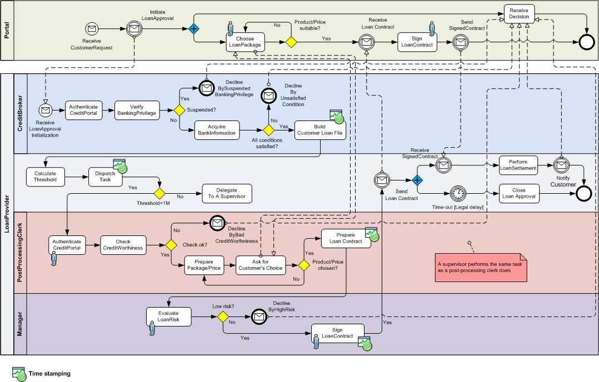

# Loan Approval Use Case

This development project, which is one outcome of the R&D project [EU FP7 COMPAS](https://cordis.europa.eu/project/rcn/85292_en.html), comprises two subprojects `portal` and `process` to demonstrate a simplified loan approval process at a fictitious West Bank.

This is an overview of the Loan Approval process in terms of [Business Process Model and Notation (BPMN)](http://www.bpmn.org).

The `process` project will implement the aforementioned business process using WS-BPEL 2.0 whilst the `Portal` will provide an end-user Web interface for working with the business process. 

More details can be found in the [documentation](loan-approval-process-document.md) and in each individual project.
