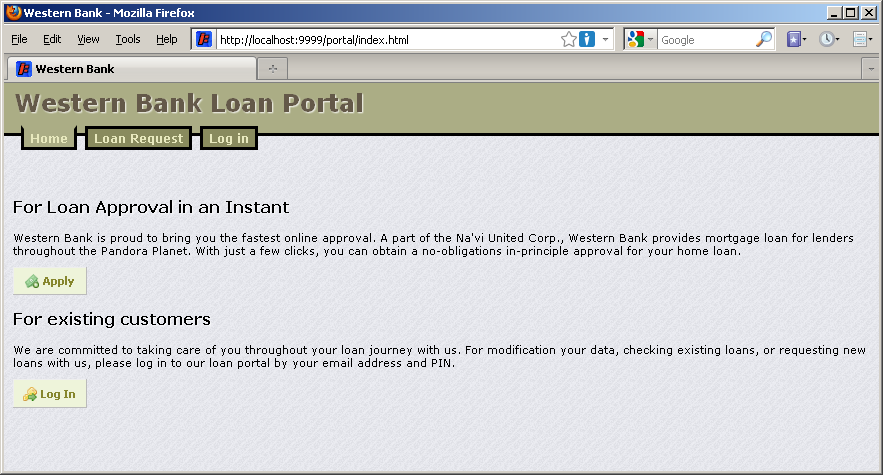
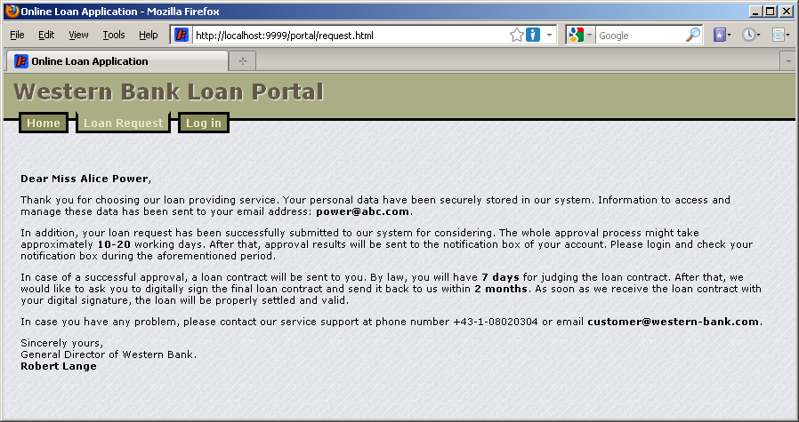
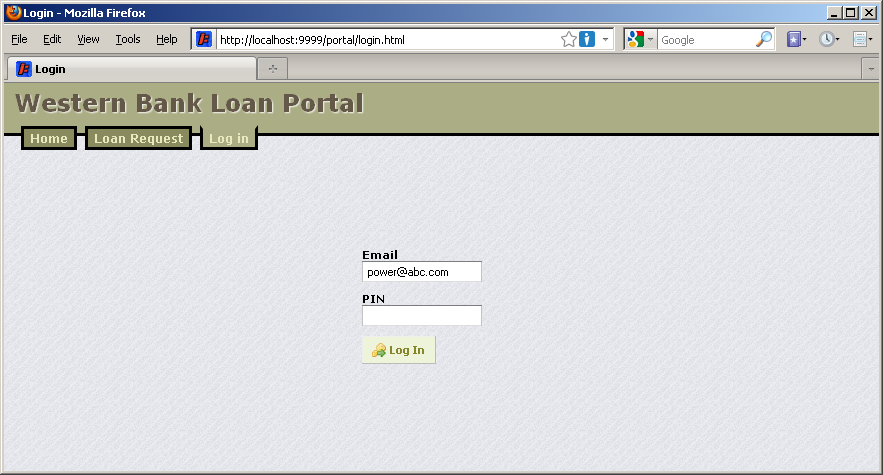
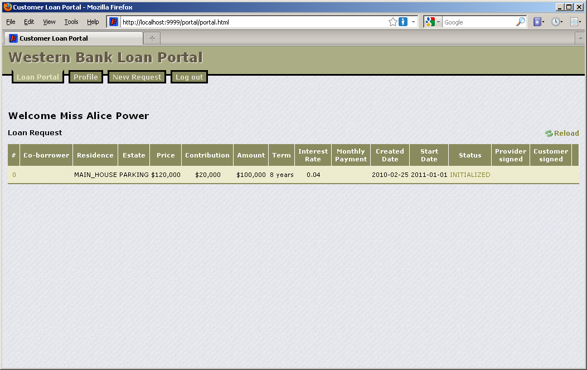
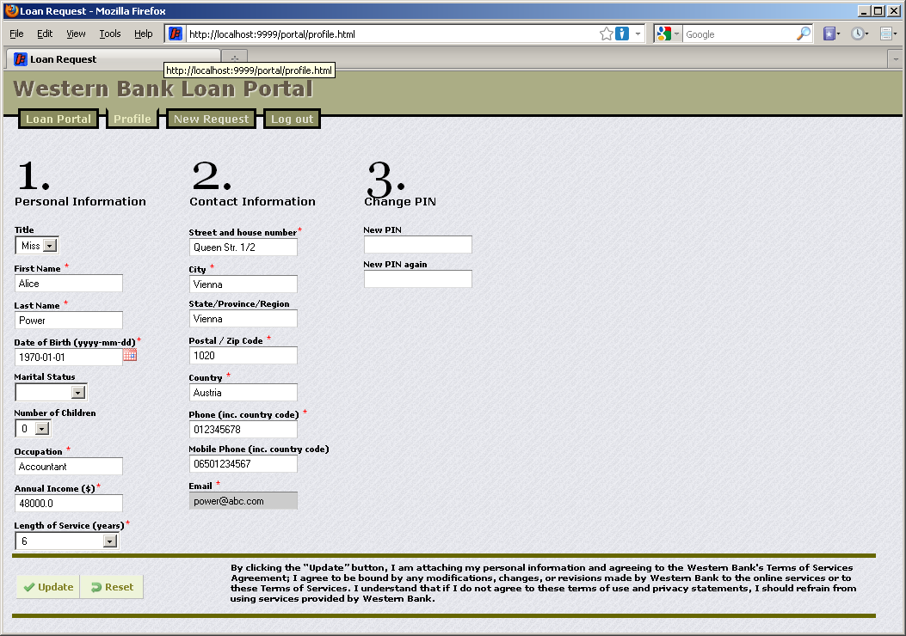
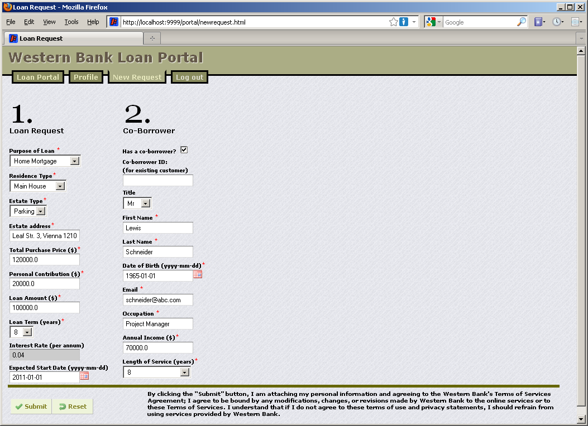
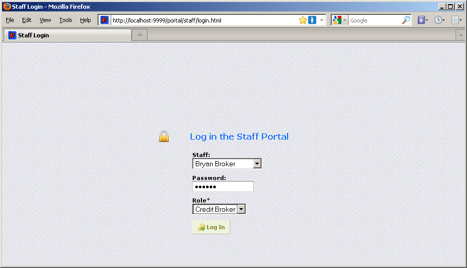
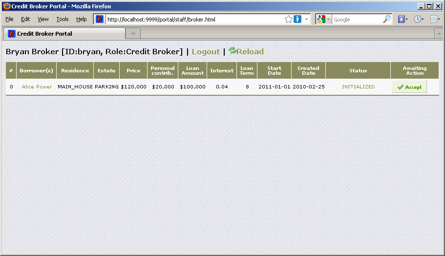
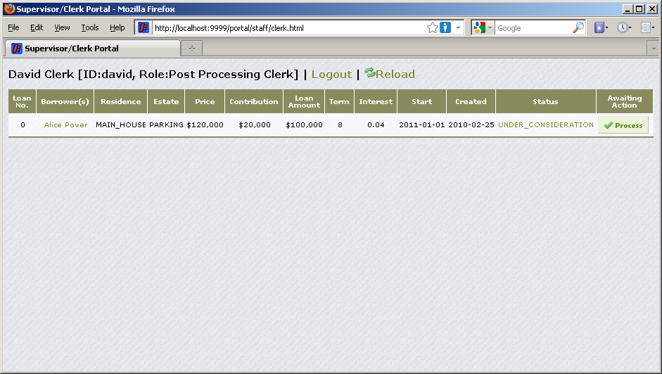
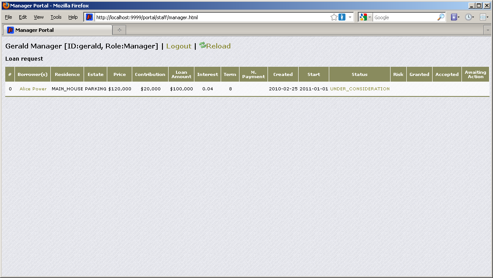

# Loan Approval User's Guide

##  Customer

1. Home page

2. New loan request

New Loan Confirmation

3. The customer's login

>  After issuing the first request, the customer's personal information is stored in the database. Later on, the customer can log in to monitor the progress of every loan request as well as modify his/her personal information.
>
> In reality, the customer's personal identification number (PIN) should be securely sent to his/her address. For testing and demonstration purposes, the customer's information is displayed in the developer page.

5. Customer's loan management page

6. Updating customer's profile

7. Customer can request another loan

## Staff

After the customer issued a new loan request, the Credit Broker can log in to his portal to handle the request. The account information of each staff can be found at the developer's portal.

> **Note**: The staff will be forward to a particular front-end according to his particular role after authenticating.

#### Credit Broker

The Credit Broker quickly examines new requests and presses the button 'Accept' to proceed.' After that, the Loan Approval process will proceed right after the first task named 'Access Portal'.

#### Supervisor/Post-processing Clerk

A Supervisor and A post-processing Clerk perform the same task but different loan amount. The Supervisor is responsible for loan requests of which the amount is more than 1 million. The other requests are handled by the Post-Processing Clerk.

As the Post-Processing Clerk / Supervisor presses the button 'Process', the Loan Approval process will continue executing right after the second task named 'Access Portal'.

#### Manager

The manager can use the portal to monitor the statuses of loan requests, consider and grant/reject the loan request with high risk, and sign the granted loan contract. These manager's tasks are aligned with the corresponding tasks of the Loan Approval process.

After the manager signed the loan contract, the customer can log in to his/her portal to see that the loan contract is granted and signed. Then, he/she has a legal time for carefully thinking before accepting or cancelling the contract. Immediately after the customer accepts, the loan contract is bound and settled.

### Developer

Page http://localhost:9999/portal/dev.html (formerly http://localhost:9999/portal/dev.list) is only used for developing/testing/debugging.

